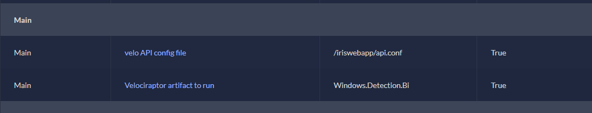
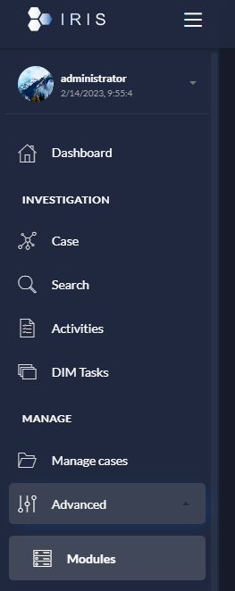
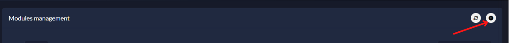
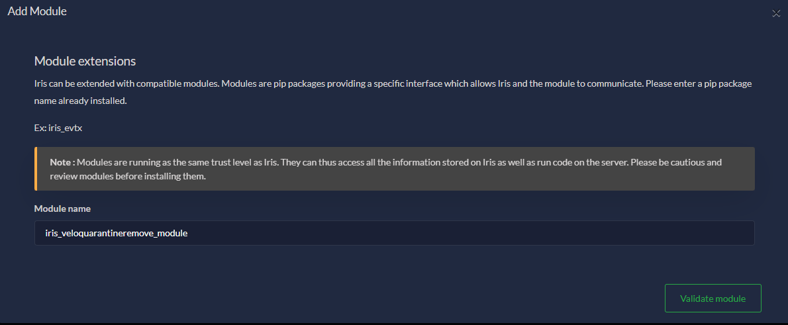
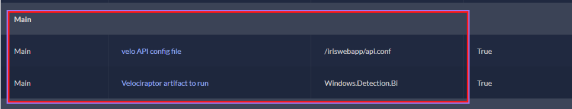
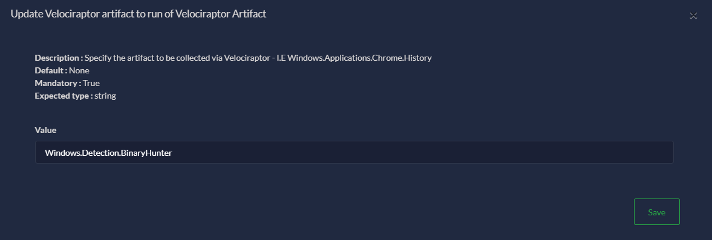
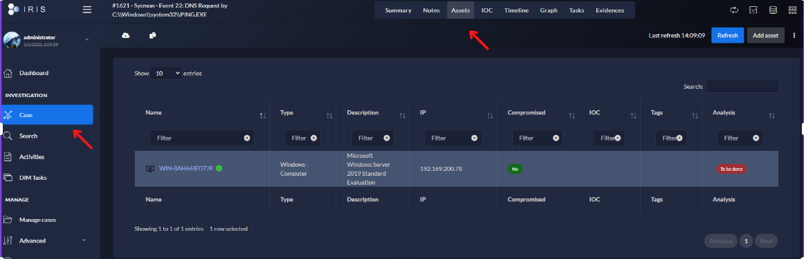
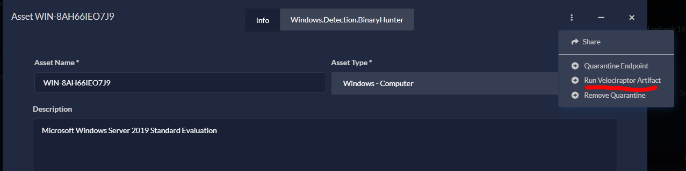

[](https://www.socfortress.co/)

# Velociraptor Artifact Module [](https://www.socfortress.co/trial.html)
> Run any Velociraptor Artifact on a Windows or Linux Endpoint


[![MIT License][license-shield]][license-url]
[![LinkedIn][linkedin-shield]][linkedin-url]
[](https://youtu.be/2EMb6zYx7_E)
[](https://www.youtube.com/playlist?list=PLB6hQ_WpB6U0WeroZAfssgRpxW8olnkqy)

<!-- PROJECT LOGO -->
<br />
<div align="center">
  <a href="https://www.socfortress.co">
    
  </a>

  <h3 align="center">Velociraptor Artifact</h3>

  <p align="center">
    SOCFortress provided DFIR-IRIS module.
    <br />
    <a href="https://www.socfortress.co/contact_form.html"><strong>Contact SOCFortress »</strong></a>
    <br />
    <br />
  </p>
</div>


<!-- Intro -->
# Intro
Remove artifact collection via Velociraptor</br>

> Get started with Velociraptor: [Video Tutorial](https://youtu.be/2kgC9Ushk9g)

The module is built for the below Asset types:
* Windows
* Linux

<div align="center" width="100" height="100">

  <h3 align="center">Configuration</h3>

  <p align="center">
    <br />
    <a href="https://github.com/socfortress/iris-velociraptorartifact-module/tree/main/images/config.PNG">
    
    </a>
    <br />
    <br />
  </p>
</div>

## Mount api.config.yaml
1. Mount the api.config.yaml file in DFIR-IRIS docker-compose for both Worker and Web-App
    * `cp api.config.yaml /opt/iris-web/docker/api.config.yaml`
    * `nano /opt/iris-web/docker-compose.yml` <br />

**Web-App**
```
app:
    build:
      context: .
      dockerfile: docker/webApp/Dockerfile
    image: iriswebapp_app:latest
    command: ['nohup', './iris-entrypoint.sh', 'iriswebapp']
    volumes:
      - iris-downloads:/home/iris/downloads
      - user_templates:/home/iris/user_templates
      - server_data:/home/iris/server_data
      - "./docker/api.config.yaml:/iriswebapp/api.config.yaml:ro"
```
**Worker**
```
worker:
    build:
      context: .
      dockerfile: docker/webApp/Dockerfile
    image: iriswebapp_app:latest
    command: ['./wait-for-iriswebapp.sh', 'app:8000', './iris-entrypoint.sh', 'iris-worker']
    volumes:
      - iris-downloads:/home/iris/downloads
      - user_templates:/home/iris/user_templates
      - server_data:/home/iris/server_data
      - "./docker/api.config.yaml:/iriswebapp/api.config.yaml:ro"
```

2. Restart the DFIR-IRIS docker-compose
    * `docker-compose down`
    * `docker-compose up -d`

<!-- Install -->
# Install
Currently, the Velociraptor Artifact module can be ran as `DFIR-IRIS` Module. </br>

> Get started with DFIR-IRIS: [Video Tutorial](https://youtu.be/XXyIv_aes4w)

### The below steps assume you already have your own DFIR-IRIS application up and running.

1. Fetch the `Velociraptor Artifact Module` Repo
    ```
    git clone https://github.com/socfortress/iris-velociraptorartifact-module
    cd iris-velociraptorartifact-module
    ```
2. Install the module
    ```
    ./buildnpush2iris.sh -a
    ```

<!-- Configuration -->
# Configuration
Once installed, configure the module to include:
* Path to api.config.yaml
* Velociraptor Artifact to run


1. Navigate to `Advanced -> Modules`

<div align="center" width="100" height="50">

  <h3 align="center">Advanced -> Modules</h3>

  <p align="center">
    <br />
    <a href="https://github.com/socfortress/ASK-SOCFortress/blob/main/images/module_webui.PNG">
    
    </a>
    <br />
    <br />
  </p>
</div>

2. Add a new module

<div align="center" width="100" height="50">

  <h3 align="center">Add a new module</h3>

  <p align="center">
    <br />
    <a href="https://github.com/socfortress/ASK-SOCFortress/blob/main/images/add_module.PNG">
    
    </a>
    <br />
    <br />
  </p>
</div>

3. Input the Module name: `iris_veloquarantineremove_module`

<div align="center" width="100" height="50">

  <h3 align="center">Input Module</h3>

  <p align="center">
    <br />
    <a href="https://github.com/socfortress/iris-velociraptorartifact-module/blob/main/images/input2_module.PNG">
    
    </a>
    <br />
    <br />
  </p>
</div>

4. Configure the module

<div align="center" width="100" height="50">

  <h3 align="center">Configure Module</h3>

  <p align="center">
    <br />
    <a href="https://github.com/socfortress/iris-velociraptorartifact-module/blob/main/images/config2.PNG">
    
    </a>
    <br />
    <br />
  </p>
</div>

5. Configure artifact to run

<div align="center" width="100" height="50">

  <h3 align="center">Configure Artifact to Run</h3>

  <p align="center">
    <br />
    <a href="https://github.com/socfortress/iris-velociraptorartifact-module/blob/main/images/config_artifact.PNG">
    
    </a>
    <br />
    <br />
  </p>
</div>

<!-- Running the module -->
# Running the Module
To run the module select `Case -> Asset` and select the dropdown menu. </br>

> Currently supports Asset of type: `Windows, Linux`


<div align="center" width="100" height="50">

  <h3 align="center">Asset</h3>

  <p align="center">
    <br />
    <a href="https://github.com/socfortress/iris-veloquarantineremove-module/blob/main/images/asset.PNG">
    
    </a>
    <br />
    <br />
  </p>
</div>

<div align="center" width="100" height="50">

  <h3 align="center">Run Module</h3>

  <p align="center">
    <br />
    <a href="https://github.com/socfortress/iris-veloquarantineremove-module/blob/main/images/running.PNG">
    
    </a>
    <br />
    <br />
  </p>
</div>

> # Device is now un quarantined


# Issues?
> If you are experiencing issues, please contact us at `info@socfortress.co`


<!-- MARKDOWN LINKS & IMAGES -->
<!-- https://www.markdownguide.org/basic-syntax/#reference-style-links -->
[contributors-shield]: https://img.shields.io/github/contributors/socfortress/Wazuh-Rules
[contributors-url]: https://github.com/socfortress/Wazuh-Rules/graphs/contributors
[forks-shield]: https://img.shields.io/github/forks/socfortress/Wazuh-Rules
[forks-url]: https://github.com/socfortress/Wazuh-Rules/network/members
[stars-shield]: https://img.shields.io/github/stars/socfortress/Wazuh-Rules
[stars-url]: https://github.com/socfortress/Wazuh-Rules/stargazers
[issues-shield]: https://img.shields.io/github/issues/othneildrew/Best-README-Template.svg?style=for-the-badge
[issues-url]: https://github.com/othneildrew/Best-README-Template/issues
[license-shield]: https://img.shields.io/badge/Help%20Desk-Help%20Desk-blue
[license-url]: https://servicedesk.socfortress.co/help/2979687893
[linkedin-shield]: https://img.shields.io/badge/Visit%20Us-www.socfortress.co-orange
[linkedin-url]: https://www.socfortress.co/